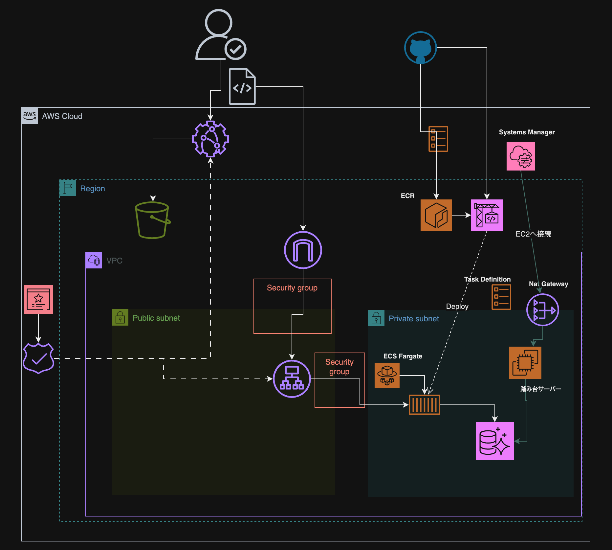
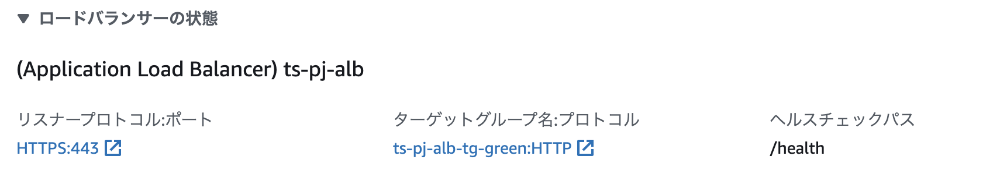

# all-typescript-project

## Common Skill set

<p align="left">
  <a href="https://skillicons.dev">
    
  </a>
</p>

## Frontend Skill set

<p align="left">
  <a href="https://skillicons.dev">
    
  </a>
</p>

## Backend Skill set

<p align="left">
  <a href="https://skillicons.dev">
    
  </a>
</p>

## IaC Skill set

<p align="left">
  <a href="https://skillicons.dev">
    
  </a>
</p>

## Infrastracture Skill set

<p align="left">
  <a href="https://skillicons.dev">
    
  </a>
</p>

## Overview

Frontend , Backend , できれば Infra も全て Typescript で開発して、モノリスアーキテクチャを体験してみる

## System Architecture

WIP

## AWS Cloud Architecture



## CI/CD Flow

WIP

## How to Linking Issue

- Refference:https://docs.github.com/en/issues/tracking-your-work-with-issues/linking-a-pull-request-to-an-issue

```sh
# commit
 git commit -m "someting commit message {issue No}"

 # PR
 Someting PR title {Closes #{issue No}}
```

## How to Development

### Backend

#### Docker

```sh
# move /backend directory
docker-compose up --build
# or
docker compose build # build
docker compose up # build and run when first run 2回目からはrunのみ

# container down
docker-compose down

# delete volume
docker volume ls
# example
docer volume rm backend_db-data

# check environment variables in container
docker exec -it { container_name } sh
printenv

# delete unnecessary image
docker image prune -f

# delete unnecessary container
docker container prune -f

# delete unnecessary container
docker volume prune -f

# イメージ、コンテナ、ネットワーク、ボリュームの全部消し
docker system prune --volumes -f
```

#### DB

- Migration

```sh
# connect docker app container
docker exec -it ts-all-app-backend sh
# run npm command migration
npm run migrate:init
```

- Connection

```sh
# use session manager connect to rds instance
# after connect bastion ec2 server , install postresql
sudo amazon-linux-extras install -y postgresql14

psql --host=<db-endpoint> --port=5432 --username=<db-username> --password --dbname=<db-name>
```

#### Redis

```sh
# connect redis server
docker exec -it {conatainer name} sh

# connected redis server , use `redis cli`
redis-cli

# Get Value by Key
GET {key name}

# Set Value
SET {key name} value
# if success set key-value , print 'OK'

# example
127.0.0.1:6379> SET example 123
OK
127.0.0.1:6379> GET example
"123"
```

## Tips

- aws command

```sh
# chekc db engine version aurora-postgress
aws rds describe-db-engine-versions --engine aurora-postgresql --query '*[].[EngineVersion]' --output text --region us-east-2
```

## What I learned this Project

- Systems manager のセッションマネージャー接続ができなかった

  - 解決
    - EC2 に IAM ロールをアタッチする
      - IAM ロールに「AmazonSSMManagedInstanceCore」ポリシーを付与する
      - IAM ロールを付与するためには、インスタンスプロファイルを作成して、IAM ロールとインスタンスプロファイルを紐づけた後に EC2 にアタッチする
    - EC2 を配置するサブネットに出入りするための口を用意してあげる
      - public サブネット
        - パブリック IP アドレスを付与する
      - private サブネット
        - Nat Gateway または VPC エンドポイントなどを設定する

- Github Actions での Docker を使った Image の Build と Deploy の際にハマった

  - 解決
    - 結論、下記の通り、 `context` を`Dockerfile`が置いてあるディレクトリをきちんと指定してあげる必要がある
    - ローカルで実行するときは、基本 Dokcerfile が置いてあるでディレクトリに移動し、Docker-compose で立ち上げているから、あまり意識する必要がないが、デプロイなどをする際は、デプロイの実行環境を把握した上で、`context`をしっかり指定してあげる必要がある。「どこを起点に Docker を Build したいのか？」を自身で理解して、座組をする必要がある。
    ```yml
    uses: docker/build-push-action@v5
    with:
      context: ./backend
      file: ./backend/Dockerfile
    ```

- ALB に対して、SSL/TLS 通信をするため ACM で証明書を付与したが、Https 通信できない

  - 確認したこと
    - ACM で発行されている証明書のドメイン名が合っているか？
      - 完全一致ではななくワイルドカード「\*」の場合、条件を満たしているか？
    - リスナールールのセッティングは合っているか？
      - 証明書が割り当てられているか？
      - 待ち受ける Port があっているか？
        - 今回ここでハマった
          - まだ ACM 設定前で疎通確認してた時は http 通信なので、リスナーの待受ポートが 80 と 8080 になっていた、、、
          - https の場合は 443、8443 にする必要がある
    - ターゲットグループのヘルスチェックのパスは合っているか？
      - デプロイ対象のアプリケーションコードを確認する
    - ECS
      - サービス画面でターゲットグループの部分を確認する
      - リスナープロトコル（待ち受け）ポートはあっているか？
        

- CodeDeploy の Install が終わらない
  - 確認したこと
    - TaskDefinition を確認
    - IAM の権限を確認
    -
